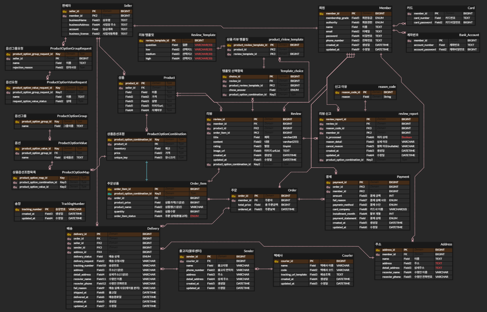

## 터틀마켓 (TurtleMarket)
Turtle Mart는 실제 e-커머스 환경에서 발생할 수 있는 동시성 문제와 대규모 트래픽 처리를 다뤄보기 위해 진행한 온라인 쇼핑몰 서비스입니다.
상품 등록부터 주문, 결제, 배송, 리뷰까지 전 과정을 지원합니다.

### 개발 기간 및 인원
- 2025.05.19 ~2025.06.13
- BE 6인

----
## 기술 스택
- Backend: Java 17, Spring Boot 3.x, Spring Data JPA, QueryDSL
- Database: MySQL
- Infra: Docker, Kafka, Redis, MinIO, Elasticsearch
---
## 핵심 기능 요약
- 회원/판매자/관리자
  - 회원가입/로그인
  - 배송 주소 등록
- 상품
  - 상품 옵션 설정
  - 상품 재고 관리
- 주문/환불
  - 주문서 생성(바로주문/장바구니 주문)
  - 장바구니 상품 추가/수량 변경
  - 환불 신청/승인
  - 상품별 판매량 조회
- 배송
  - 택배사 등록/삭제
  - 출고지(물류센터) 등록
  - 배송 정보 생성
- 리뷰
    - 만족도 질문 템플릿 생성
    - 리뷰 신고/신고 취소
- 결제
    - 결제 수단(카드/계좌) 등록
---
## ERD

- 총 25개의 테이블로 구성
### 핵심 테이블 설명
**[상품]**
- **ProductOptionGroup (옵션그룹)**: 옵션의 **카테고리명**을 저장하는 테이블입니다.
  *예) ‘색상’ 카테고리*
- **ProductOptionValue (옵션)**: 카테고리에 들어갈 **세부 옵션**을 저장하는 테이블입니다.
  *예) ‘색상’ 카테고리 안에 들어갈 ‘레드, 블루, 블랙’ 옵션*
- **ProductOptionMap (상품-옵션 매핑)**: 상품에 어떤 세부 옵션들이 연결되어 있는지 매핑하는 테이블입니다.
  *예)* *상품1 - 블랙
  상품1 - 270*
- **ProductOptionCombination (상품-옵션 조합)**: 상품과 옵션을 조합, **상품의 옵션별 재고·가격** 등을 저장하는 테이블입니다.
  *예) ‘운동화 - 블랙/270’: 잔여수량 10, 가격 50,000
  ‘운동화 - 레드/240’: 잔여수량 2, 가격 30,000*

**[주문]**
- **Order_Item (주문항목)**: 1건의 주문 내역에 해당하는 상품들의 정보를 저장합니다. 주문 시점의 가격, 수량, 주문 상태, 상품 옵션(ProductOptionCombination)을 저장합니다.

---
## API 명세서
[API 명세서 보기](https://docs.google.com/spreadsheets/d/1G0KLbiotahvpXxDXf4sUeHTZF8LhHiuqZHQouE-zzNk/edit?gid=2043215687#gid=2043215687)

---
## 팀원 및 역할
- [한성우](https://github.com/hajoo0322)(리더): 상품 도메인
- [임수민](https://github.com/sumin9926): 주문 도메인
- [이수진](https://github.com/jin18302): 리뷰 도메인
- [방동혁](https://github.com/HappyBeny): 결제 도메인
- [이승찬](https://github.com/tmdcksdl): 배송 도메인
- [송준일](https://github.com/thdwnsdlf61): 회원 도메인
- [강세민](https://github.com/KangSemin)(리뷰어)